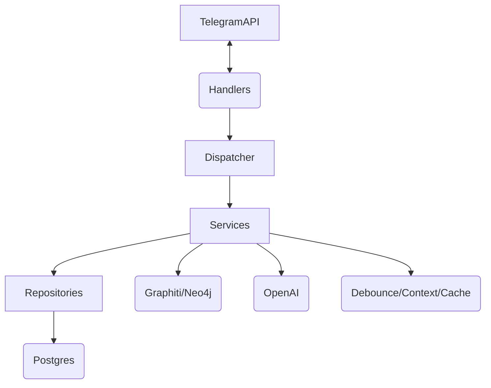

# Telegram Memory Bot

A "friend with memory" Telegram group chat bot. It observes conversations, builds a knowledge graph of facts, and provides contextual, memory-augmented responses.

## 1. Overview

This bot acts as a persistent participant in Telegram group chats. It remembers facts, user preferences, and conversational context using a Graphiti (Neo4j) knowledge graph and Postgres database. It's designed to be added to groups (with Admin privileges or Group Privacy Mode disabled) where it can quietly listen, build a memory profile of the group, and respond when mentioned.

## 2. Architecture

The application follows a layered architecture to separate concerns:

- **Handlers**: Telegram update handlers (aiogram).
- **Services**: Business logic (`MemoryService`, `ResponseService`, `ContextBuilder`, `MessageDebouncer`).
- **Repositories**: Data access layer (`ChatRepository`, `MemberRepository`, `TokenUsageRepository`).
- **Infrastructure**: Implementations of interfaces for DB, Redis, LLMs, and Graphiti.



### Key Components
- **Graphiti Memory**: Uses Neo4j to build semantic knowledge graphs of user interactions.
- **Debouncer**: Buffers messages in Redis before batch processing to the memory backend, reducing LLM token costs.

## 3. Quick Start

### Prerequisites
- Docker & Docker Compose
- Telegram Bot Token (from [@BotFather](https://t.me/BotFather))
- OpenAI API Key

### Setup Steps
1. Copy `.env.example` to `.env` and fill in your keys.
2. Build and start the services:
   ```bash
   docker compose up --build -d
   ```
3. Talk to [@BotFather](https://t.me/BotFather):
   - Select your bot -> Bot Settings -> Group Privacy -> **Turn Off**
   - Alternatively, make the bot an admin in the group so it sees all messages.

## 4. Configuration

All configuration is done via environment variables (`bot.config.Settings`).

| Environment Variable | Description |
|----------------------|-------------|
| `TELEGRAM_BOT_TOKEN` | Your Telegram Bot token |
| `OPENAI_API_KEY` | OpenAI API key for LLM and Embeddings |
| `POSTGRES_DSN` | Async Postgres connection string (`postgresql+asyncpg://...`) |
| `POSTGRES_DSN_SYNC`| Sync Postgres connection string (`postgresql+psycopg://...`) for Alembic |
| `REDIS_URL` | Redis connection URL |
| `NEO4J_URI` | Neo4j bolt/neo4j URI |
| `NEO4J_USER` | Neo4j username |
| `NEO4J_PASSWORD` | Neo4j password |
| `ADMIN_USER_ID` | Telegram User ID of the bot admin |
| `ADMIN_CHAT_ID` | Default chat ID for alerts/defaults |
| `BOT_LANGUAGE` | Language for LLM responses |

## 5. Persona Setup

You can configure the bot's identity and behavior by setting the persona configuration:
- Configure `bot_name_list` to include aliases the bot should respond to.
- Override `get_persona_prompt()` in `bot.config` or provide a system prompt file to define the bot's personality.

## 6. Memory & Privacy Design

- **Observation**: The bot observes all group messages to build context. *Group members should be informed of its presence and function.*
- **Two-Level Memory**:
  - *Quick lookup*: Fast profile metadata lookup in Redis/Postgres.
  - *Deep search*: Semantic search against the Neo4j Graphiti backend.
- **Sensitive Topics**: Pre-ingestion scanning filters sensitive information before it hits the LLM. Categories are configurable.
- **Admin Commands**: Admins can run `/forget_fact` to scrub specific entries from the memory graph.

## 7. Docker Compose Setup

- `docker-compose.yml`: Fully isolated, conflict-free setup. Exposes **no ports** on the host. All services (bot, postgres, redis, neo4j) communicate strictly over the internal `botnet` network. This guarantees **zero port conflicts** with any other Redis or Postgres instances already running on the server or developer machine.
- `docker-compose.override.yml.example`: Optional dev-only template. If you explicitly want to connect to Postgres or Redis from your host machine (e.g., via DBeaver or Redis Insight), copy this file to `docker-compose.override.yml`. It uses non-standard, configurable fallback ports (`16379`, `15432`, `17474`, `17687`) via `DEV_*_PORT` environment variables to prevent collisions.


## 8. Admin Commands

- `/memory_stats` - Display memory graph size and statistics.
- `/forget_fact <fact_id>` - Remove a specific fact from the graph.

*(Commands require the user ID to match `ADMIN_USER_ID` in config).*

## 9. Multi-Chat Support

The bot is designed to handle multiple groups simultaneously.
- Every chat is registered in the `chats` table.
- Fact extraction and retrieval are scoped to `group_id` / `chat_id`.
- Context buffers are separated by chat in Redis.

## 10. Backup

You should regularly back up Postgres and Neo4j.

**Postgres Backup:**
```bash
docker exec -t <postgres-container> pg_dump -U botuser -F c bot > pg_backup.dump
```

**Neo4j Backup:**
```bash
docker exec -t <neo4j-container> neo4j-admin database dump system --to-path=/data/backups
```
*Tip: Set up a cron job on the host machine to run these commands daily.*

## 11. Development

- Developed using `uv` for fast dependency management.
- Formatting/Linting: Use Ruff and Mypy.
- Architecture allows easy mocking of `MemoryBackend` and `LLMProvider` for tests.

## 12. Telegram Setup Notes

- Without "Group Privacy" turned off, the bot will only see messages explicitly starting with a `/` command or replies directly to its messages.
- For full memory functionality, the bot must see all messages. Turn off Group Privacy via BotFather, or promote the bot to Administrator in the chat.

## 13. Interactive Web Testing Simulator

A minimalist React 18 panel is included for manual testing without needing a Telegram group:
```bash
uv run python scripts/simulator_server.py
```
Open **http://127.0.0.1:8080** in your browser to:
- Simulate multiple group members chatting (Alice, Bob, Charlie, Admin).
- Test bot mentions, transliterated names, and word boundaries.
- Inspect the Knowledge Graph facts in real time.
- Verify sensitive topic filtering and redaction.
- Test `/forget_fact` and `/memory_stats` admin commands.
